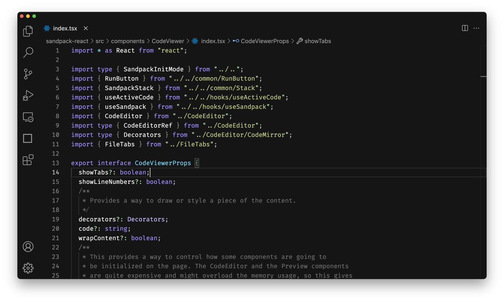

<div align="center">
  <h1 align="center">CodeSandbox Theme</h1>
  <p align="center">An official CodeSandbox theme for Visual Studio Code.</p>
</div>



## Install

Install this syntax theme [from the Marketplace][theme-install].

## Recommendations

Below you can find a few recommendations for your `settings.json` to match the CodeSandbox experience even closer in your Visual Studio Code:

```json
{
  "editor.fontSize": 14,
  "editor.fontFamily": "'Fira Code'",
  "editor.fontLigatures": true
}
```

> You can download the [Fira Code font][fira-code-install] from GitHub.

## CodeSandbox Projects Extension

Did you know you can get the entire power of CodeSandbox right in your editor, not just the theme? Check out the [CodeSandbox Projects extension][projects-install] for Visual Studio Code to enable features like live following, collaborative tasks and terminals, enhanced Git workflow, and so much more!

## Contribute

Found an issue? Would like to propose an improvement? Please follow our [Contribution guidelines](CONTRIBUTING.md) to make those changes happen. Thank you!

[theme-install]: https://marketplace.visualstudio.com/items?itemName=CodeSandbox-io.codesandbox-theme
[fira-code-install]: https://github.com/tonsky/FiraCode
[projects-install]: https://marketplace.visualstudio.com/items?itemName=CodeSandbox-io.codesandbox-projects
